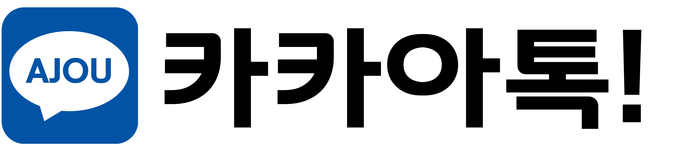
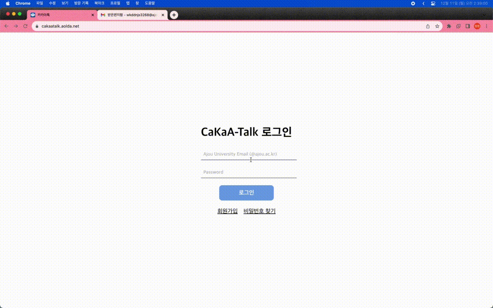
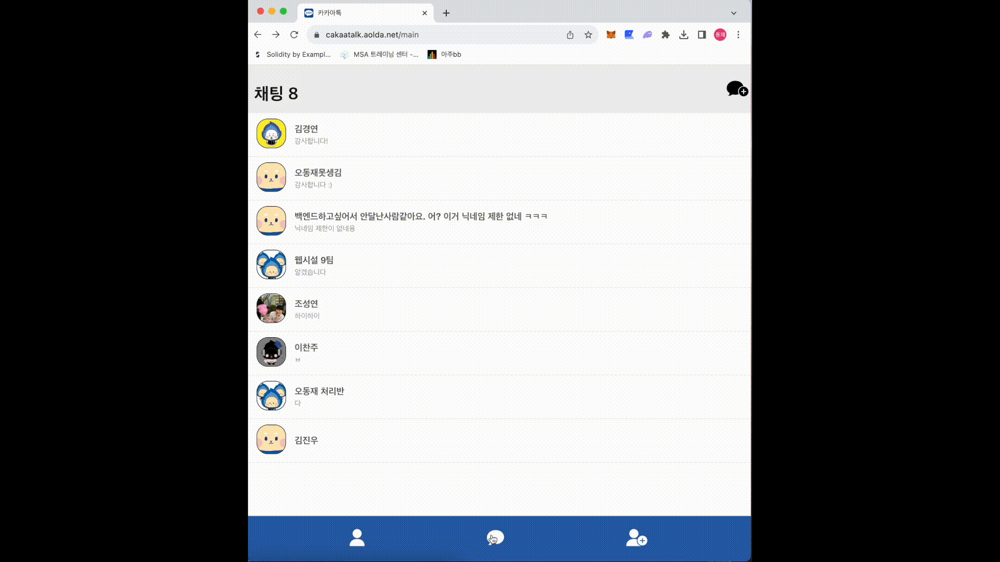
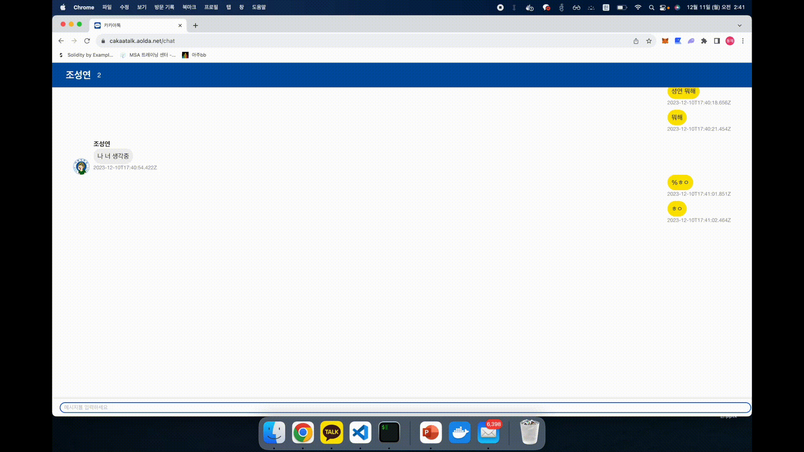
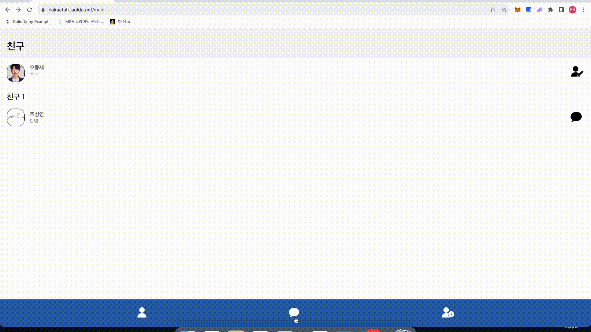
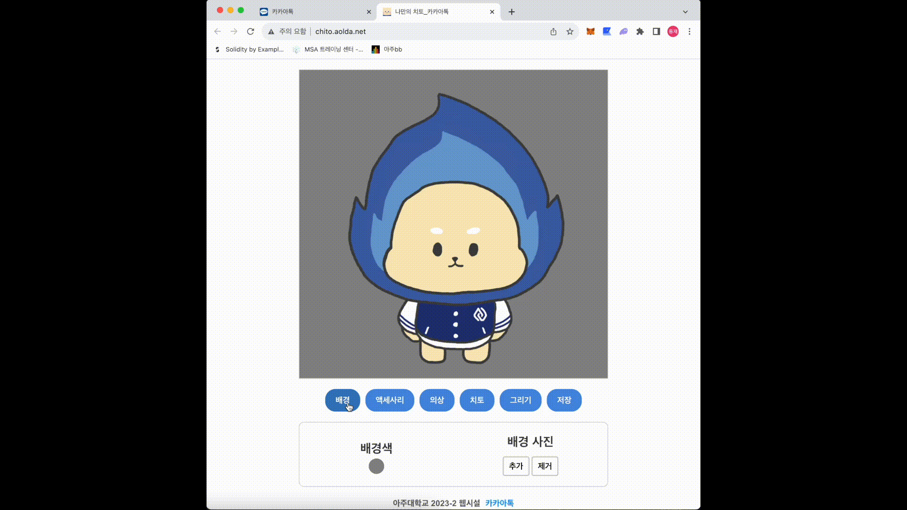
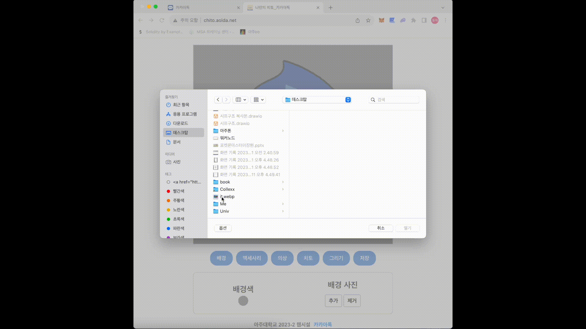
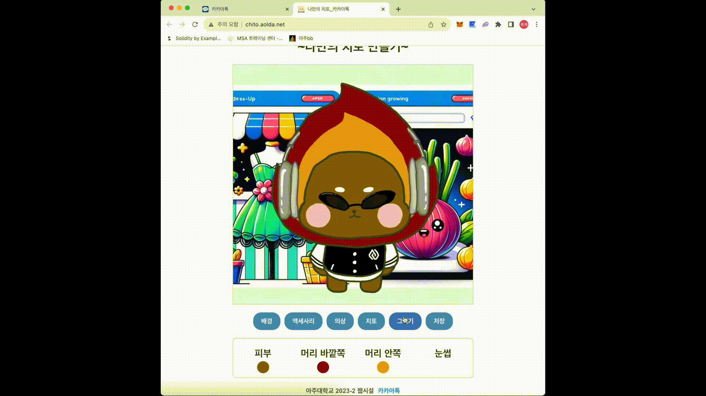

# CaKaA Talk

## 기능

### main service - 채팅 관련 기능

<table style="width:99%">
    <tr>
        <th style="width:30vw;"> 회원 가입</th>
        <th style="width:30vw;"> 프로필 변경</th>
        <th style="width:30vw;">친구 추가</th>
    </tr>
    <tr>
        <td> </td>
        <td></td>
        <td></td>
    </tr>
</table>
<table style="width:66%">
    <tr>
        <th style="width:30vw;"> 갠톡</th>
        <th style="width:30vw;"> 단톡</th>
    </tr>
    <tr>
        <td> </td>
        <td></td>
    </tr>
</table>

### sub service - 프로필 직접 만들기

<table style="width:66%">
    <tr>
        <th style="width:30vw;"> 배경 변경</th>
        <th style="width:30vw;"> 악세사리 장착</th>
    </tr>
    <tr>
        <td> </td>
        <td></td>
    </tr>
</table>
<table style="width:66%">
    <tr>
        <th style="width:30vw;"> 색 변경</th>
        <th style="width:30vw;"> 그림 그리기</th>
    </tr>
    <tr>
        <td> </td>
        <td></td>
    </tr>
</table>

## 러다이트 운동

외부 라이브러리를 최대한 사용하지 않고 구현하였습니다.

자세한 내용은 [발표자료](./presentation-docs/최종발표.pdf)에서 확인하실 수 있습니다.
